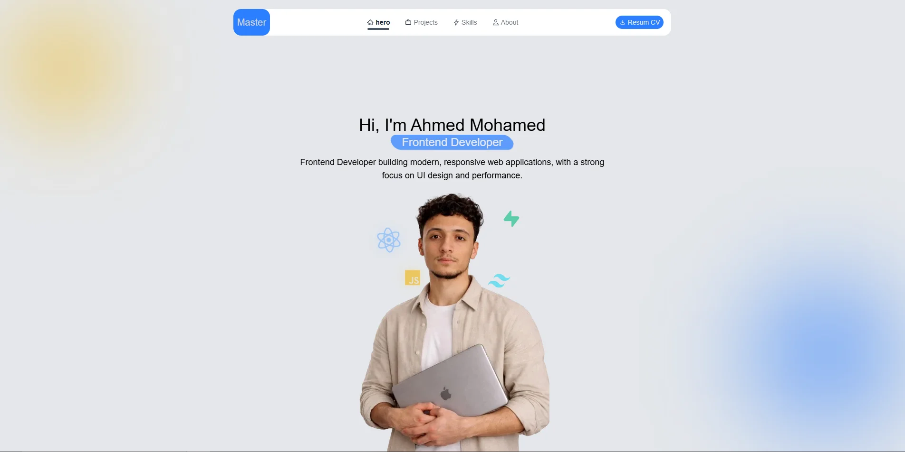

# 🚀 Portfolio Website

A modern and responsive **Frontend Developer Portfolio** built with React and Tailwind CSS to showcase my skills, projects, and experience.

---

## 📌 About The Project

This is my personal portfolio website where I present:

* My background as a Frontend Developer
* My technical skills
* Selected projects I've built
* Ways to contact me

The main goal of this project is to demonstrate my ability to build clean, responsive, and high-performance user interfaces.

---

## 🛠️ Built With

* ⚛️ React JS
* 🎨 Tailwind CSS
* 🎯 React Icons
* 🎬 Framer Motion
* 📜 JavaScript (ES6+)

---

## ✨ Features

* 📱 Fully Responsive Design (Mobile First)
* 🎨 Clean and Minimal UI
* 🎬 Smooth Animations using Framer Motion
* ⚡ Optimized Performance
* 🧩 Reusable Components Structure

---

## 📂 Project Structure

```
src/
├── assets/        # Images & icons
├── components/    # Reusable components
├── sections/      # Page sections (Hero, About, Projects...)
├── data/          # Static data (projects, skills)
├── App.jsx
└── main.jsx
```

---

## 🚀 Getting Started

To run the project locally:

```bash
npm install
npm run dev
```

---

## 📸 Screenshots



---

## 🔗 Live Demo

https://portfolio-695c6.web.app/

---

## 📬 Contact

* Email: [your-email@example.com](mailto:ahmed.code.rex@gmail.com)
* GitHub: https://github.com/ahmedcoderex
* LinkedIn: www.linkedin.com/in/ahmed-mohamed-b54bb336a

---

## 🎯 Future Improvements

* Add Dark Mode 🌙
* Improve accessibility
* Add more interactive animations
* Integrate backend for contact form

---

## 👨‍💻 Author

Ahmed – Frontend Developer
Focused on building modern, responsive, and user-friendly web applications using React.

---
